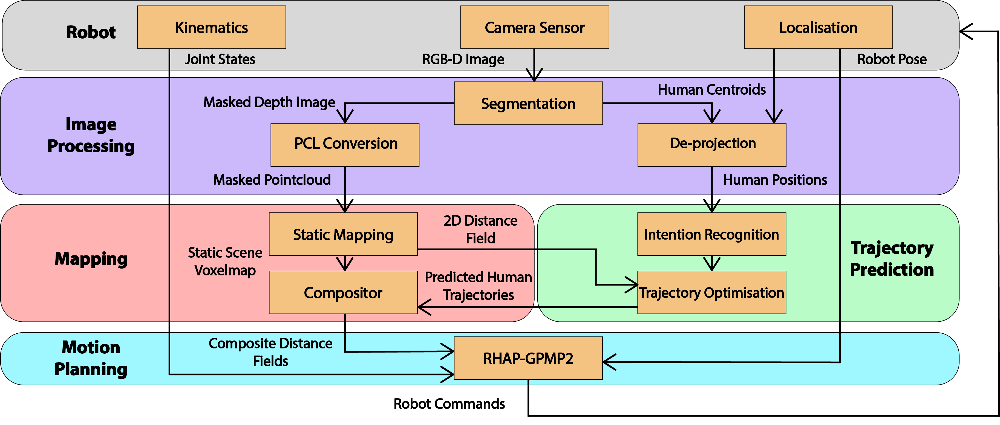

Integrated Dynamic Motion Planning Framework
===================================================

## Overview
-----

This repository provides instructions on how to install our integrated framework
for predictive whole-body motion planning in dynamic environments, as described
in the paper:<br>
"Motion Planning in Dynamic Environments Using 
Context-Aware Human Trajectory Prediction", <em>Mark Nicholas Finean, Luka Petrović, 
Wolfgang Merkt, Ivan Marković, and Ioannis Havoutis</em>, submitted to The International Journal
of Robotics Research. <br>

Link to: [Preprint](http://arxiv.org/abs/2201.05058)<br>
Link to: [Video](https://www.youtube.com/watch?v=gdC3mpZNjG4&t=5s)<br>
Link to: [Dataset](https://ori-drs.github.io/oxford-indoor-human-motion-dataset/)<br>


<!--  -->


## Install Summary
------

We list the packages required to run our framework below.

Libraries to install (consult install instructions within library):
- GTSAM
- GPMP2 (our fork)
- GPU-Voxels (our fork)
  
The following packages can be cloned and build within a catkin workspace:
- gpu_voxels_ros
- sdf_mp_integration
- genpy
- trajectory-prediction-ros
- robot_self_filter

Additionally, to perform image segmentation and human position 
estimate, you will need to run a docker image:
- centermask2

## Install Instructions 
-----

Prerequisites
------

- CMake >= 3.0 (Ubuntu: `sudo apt-get install cmake`)
- [Boost](http://www.boost.org/) >= 1.50 (Ubuntu: `sudo apt-get install libboost-all-dev`)

Installation (C++ libraries only)
------

- Install GTSAM (our fork).
  ```bash
  git clone https://github.com/ori-drs/gtsam.git
  cd gtsam
  git checkout develop
  mkdir build && cd build
  cmake ..
  make check  # optional, run unit tests
  make install
  ```
<!-- - Setup paths.
  ```bash
  echo 'export LD_LIBRARY_PATH=/usr/local/lib:${LD_LIBRARY_PATH}' >> ~/.bashrc
  echo 'export LD_LIBRARY_PATH=/usr/local/share:${LD_LIBRARY_PATH}' >> ~/.bashrc
  source ~/.bashrc
  ``` -->
- Install gpmp2 (our fork).
  ```bash
  git clone https://github.com/ori-drs/gpmp2.git
  cd gpmp2 && mkdir build && cd build
  cmake -DCMAKE_BUILD_TYPE=Release  ..
  make check  # optional, run unit tests
  make install
  ```
- Install GPU-Voxels (our fork).
Need to switch to g++ and gcc. Also need to download the latest eigen.
  ```bash
  git clone https://github.com/ori-drs/gpu-voxels.git
  cd gpu-voxels && mkdir build && cd build
  cmake -DCMAKE_PREFIX_PATH=/{path_to_eigen_install_dir} ..
  make check  # optional, run unit tests
  make install
  ```

Catkin Workspace (C++ only)
------

  ```bash
  mkdir ws && cd ws && mkdir src && cd src
  git clone https://github.com/ori-drs/gpu_voxels_ros.git
  git clone https://github.com/ori-drs/sdf_mp_integration.git
  git clone https://github.com/ros/genpy.git
  git clone https://github.com/ori-drs/trajectory-prediction-ros.git
  git clone https://github.com/ori-drs/robot_self_filter.git
  cd ../..
  catkin build
  echo 'source /{path_to_ws}/devel/setup.bash' >> ~/.bashrc
  ```

## Citing
-----

If you use this work, please cite following publications:

```
@INPROCEEDINGS{Finean2022,
  author={Finean, Mark Nicholas and Petrović, Luka and Merkt, Wolfgang and Marković, Ivan and Havoutis, Ioannis},
  title={Motion Planning in Dynamic Environments Using Human Trajectory Prediction}, 
  year={2022},
  }
```

## License
-----
While this repository is licensed under the BSD-3-Clause license, it uses multiple third-party packages which operate under different licenses. 

We provide a summary indication of the licenses below but please consider any licensing information 
provided in the individual packages:

| Package                               | License |
| ----------- | ----------- |
| GPU-Voxels                            | CDDL       |
| GPU-Voxels (icl_core helper library)  | CDDL        |
| GPU-Voxels (build system)             | BSD        |
| GPU-Voxels (PBA kernel code)          | BSD-like license (consult the file LICENSE_PBA.txt)        |
| GTSAM                                 | Simplified BSD        |
| GPMP2                                 | BSD        |
| robot_self_filter                     | BSD        |
| gpu_voxels_ros                        | BSD-3-Clause        |
| sdf_mp_integration                    | BSD-3-Clause        |
| trajectory-prediction-ros             | BSD-3-Clause        |
| genpy                                 | BSD        |
| centermask2                           | Attribution-NonCommercial 4.0 International        |
| centermask2_ros                       | BSD-3-Clause        |


## Questions and Feedback
-----
We are always interested in hearing how people are using our software, 
so please get in contact if you have questions or comments about this work.